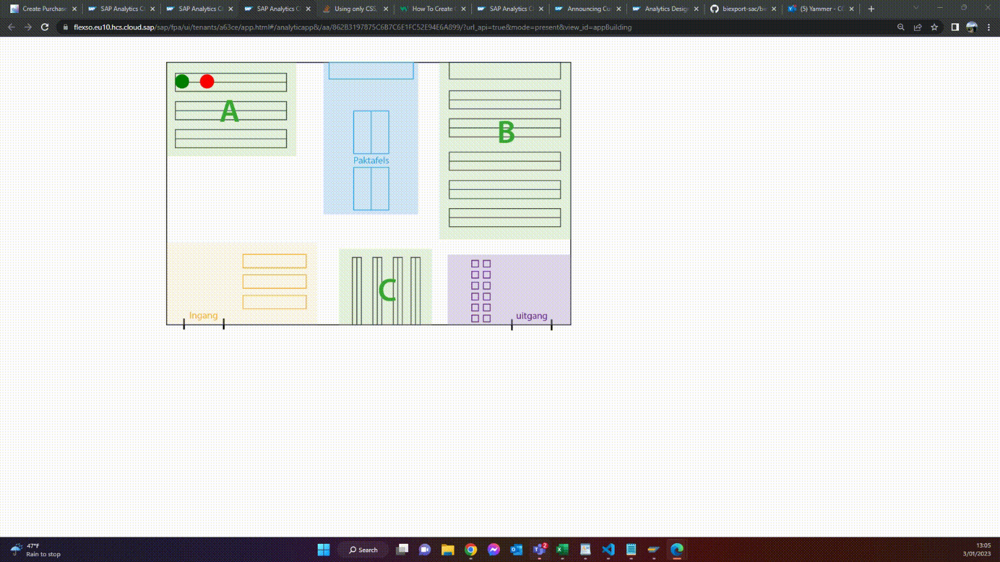
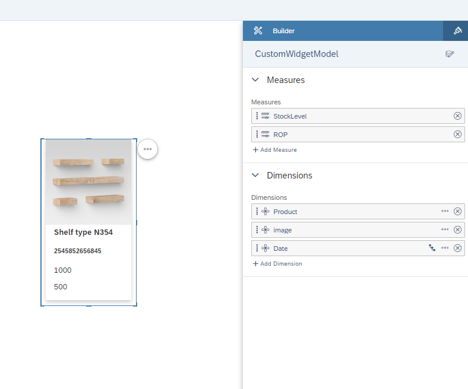
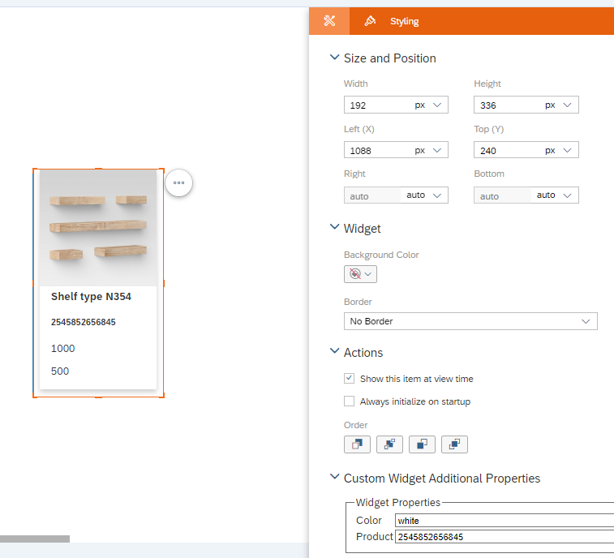

# SAP Analytics Cloud Custom Widget Configuration

## Custom widgets in SAP Analytics Cloud
A SAP Analytics Cloud custom widget is built using the SAPUI5 JavaScript framework. The widget is essentially a reusable component that can be added to the SAP Analytics Cloud platform to provide additional functionality to users. The widget is built using a combination of HTML, JavaScript, and CSS, and can be configured to interact with the SAP Analytics Cloud platform using APIs.

## Context
The purpose of the widget is to act as some kind of storage location of a certain product. A map of the warehouse can be imported into SAC through an analytical application. The widget can then be selected and it immediately turns red or green. Red means the stock level is lower than the re-order point, green means the re-order point is still not reached. See the GIF attachment below for the result.

**TIP:** Make sure to use the Dev Tools built-in Google Chrome for easy debugging! (ctrl+shift+J)

### The result :


- The properties of the widget are stored in a SAP Analytics Cloud model.
	- Image link to online stored location (f.e. GitHub Page or Google Image)
	- Measure data is retrieved through the data binding configured in the builder panel
	- dynamic colors are configured in the WebComponent Script
	- Hover actions can be configured with HTML/CSS/JS

#### What is Covered?
- Data Binding in builder panel
	- Data binding in back-end with Analytical Application API Calls
- Custom Widget Interface (JSON + HTML + JavaScript)
- Custom Builder Panel interface (JSON + HTML + JavaScript)
- Custom Styling Panel Interface (JSON + HTML + JavaScript)
- Local Hosting for development
- GitHub Hosting for production -> (to be replaced with Cloud Foundry later?)
- Dynamic changement of properties
#### What is not Covered?
- External API-Calls
- OData Call
- External Data Import
- Custom Builder Panel


### TO DO
- Add button with link to order in S/4HANA System
### Links : 
- https://blogs.sap.com/2020/11/12/how-to-access-non-standard-data-sources-within-sap-analytics-cloud/
- https://blogs.sap.com/2022/12/04/demystifying-custom-widgets-for-sap-analytics-cloud/
- https://help.sap.com/doc/c813a28922b54e50bd2a307b099787dc/release/en-US/CustomWidgetDevGuide_en.pdf
- https://www.linkedin.com/pulse/fast-filterous-part-3-nico-reichen/
- https://www.sac-export.com/blog/sac-custom-widget-data-binding-creating-a-csv-download-component
- https://blogs.sap.com/2022/05/25/announcing-custom-widgets-data-binding-in-sap-analytics-cloud-analytics-designer/
- https://blogs.sap.com/2022/08/24/deploying-custom-widget-into-sap-btp-cloudfoundry/
- https://blogs.sap.com/2022/11/23/hosting-sap-analytics-cloud-custom-widgets-into-github/
- https://blogs.sap.com/2021/12/29/deep-integration-of-sap-analytics-cloud-and-arcgis/
- https://blogs.sap.com/2019/12/06/build-a-custom-widget-in-sap-analytics-cloud-analytics-application/
- https://blogs.sap.com/?p=1662489?source=email-global-notification-bp-new-in-tag-followed

### Components : 
- JSON-File
- JS-File for Styling Panel interface
- JS-File for the Web Component
- (opt) GitHub Page repository for custom widget hosting
- Model in SAP Analytics Cloud

## The JSON-File
### We want to give a name and id to our widget first. This will help us to find the widget in SAC later.

```json
"name": "localhost",
	"description": "",
	"newInstancePrefix": "localhost",
	"eula": "",
	"vendor": "cas",
	"license": "",
	"id": "localhost",
	"version": "1.0.1",
	"icon": "",
```
### References
The next step is to create references to our JavaScript-Files. For the sake of this demonstration, we will only use the custom configuration of the main object and the styling panel. This is done so we can add the data-binding object to the builder panel later. When adding custom logic to the builder panel, predefined logic will be cleared. This is one of the reasons why we have to add the product number through the styling panel.

**Warning** : For now, the url is referring to my local server, where the JS-objects are stored. These can be replaced with the GitHub-URLs when hosting on GitHub. This is also the case for widget hosting on SAP Cloud Foundry.


```json
"webcomponents": [
		{
			"kind": "main",
			"tag": "custom-button",
			"url": "http://localhost:5500/github2712/Webcomponent.js",
			"integrity": ""	,
			"ignoreIntegrity": true
			
		},
		{
			"kind": "styling",
			"tag": "com-sap-sample-coloredbox-styling",
			"url": "http://localhost:5500/github2712/stylingpanel.js",
			"integrity": "",
			"ignoreIntegrity": true
		}
	],
  ```
  
  ### Basic Configuration
  I will not go through the basic configuration of the properties and functions. Basically, you will define the naming/functionality of subcomponents and methods here.
  
  ### DataBinding
  **Important** : Be sure to add the following code in order to be able to link a SAC model to your widget!
  ```json
  "dataBindings": {
		"myDataBinding": {
		  "feeds": [
			{
			  "id": "dimensions",
			  "description": "Dimensions",
			  "type": "dimension"
			},
			{
			  "id": "measures",
			  "description": "Measures",
			  "type": "mainStructureMember"
			}
		  ]
		}
	}
  ```
 
  
  ## WebComponent
  First thing to do when adding the WebComponent, is to define the visual itself. This is done with HTML and CSS. (CSS can also be defined in a separate file) 

  Make sure to add the **Class** and **ID** to the components you want to make dynamic with the JS later!
  ```JS
  
let template = document.createElement("template")
	template.innerHTML = `
	<style>
	.card {
	  display : none;
	  background-color:white;
	  box-shadow: 0 4px 8px 0 rgba(0,0,0,0.2);
	  transition: 0.3s;
	  width: 90%;
	  margin-left:auto;
	  margin-right:auto;
	  border:3px solid;
	}

	.button {
		background-color: #019CE0;
		border: none;
		border-radius:10px;
		color: white;
		padding: 5px 10px;
		text-align: center;
		text-decoration: none;
		display: inline-block;
		font-size: 16px;
		margin: 4px 2px;
		cursor: pointer;
		width:75px;
		height:40px;
		margin-left:auto;
	  	margin-right:auto;
	  }

	.bullet{
		background-color:red;
		height:35px;
		width: 35px;
		border-radius:50%;
		display:block;
	}

	.bullet:hover + .card{
		display:block;
	}
	
	.card:hover {
	  box-shadow: 0 8px 16px 0 rgba(0,0,0,0.2);
	  display:block;
	}
	
	.container {
	  padding: 2px 16px;
	}
	</style>
	<div class="bullet" id="bullet"></div>
	<div class="card" id="card">
	  
	  <div class="container">
		<b id = "product"></b>
		<h5><b id = "number"></b></h5>
		<p id = "measure"><p>
		<p id = "ROP"><p>
		<a class="button" id="button" href="#" target = "_blank">Order</a>
	  </div>
	</div>
	
```
  ### Constructor
  The Root is later used to modify our previously defined HTML objects. Also, an 'onClick' event is attached to the widget.

  ```js
  constructor() {
			super();
			let shadowRoot = this.attachShadow({mode: "open"});
			shadowRoot.appendChild(template.content.cloneNode(true));
			
			this.addEventListener("click", event => {
				var event = new Event("onClick");
				this.fireClick();
				this.dispatchEvent(event);
			});
			this._props = {};
```

### Updating the widget

The following functions make sure data added or modified through the UI, will automatically update the widget. 
```js
onCustomWidgetBeforeUpdate(changedProperties) {
			this._props = { ...this._props, ...changedProperties };
		}

		onCustomWidgetAfterUpdate(changedProperties) {
			this.setData()
			console.log(JSON.stringify(changedProperties));
			/*if ("color" in changedProperties) {
				this.style["background-color"] = changedProperties["color"];
			}*/
			if ("prod_number" in changedProperties) {
				this.prod_number = changedProperties["prod_number"];
			}
		}
```

### Dynamic Widget Configuration
This is where everything comes together. In this function, we will first select all our widget objects, link them to their model data, and define their styling based on conditions.

The data is fetched through the databinding object, defined in the JSON-File before!

By selecting objects from the HTML init, we can dynamically change the widgets properties and visualizations. 
```js
setData(){
			let measure = 0;
			let product = "";
			let image = "";
			let rop = "";
			console.log(this.prod_number)
			this.myDataBinding.data.forEach(row => {
				if(row["dimensions_0"]['id'] === this.prod_number){
					measure = row["measures_0"]["raw"];
					product = row["dimensions_0"]["label"];
					image = row["dimensions_1"]["id"];
					rop = row["measures_1"]["raw"];
				}
				//console.log('row : '+JSON.stringify(row));
			})
			this.shadowRoot.getElementById("measure").innerText = measure;
			this.shadowRoot.getElementById("product").innerText = product;
			this.shadowRoot.getElementById("number").innerText = this.prod_number;
			this.shadowRoot.getElementById("ROP").innerText = rop;
			this.shadowRoot.getElementById("img").src = image;
			this.shadowRoot.getElementById("button").href = "https://linflexhana.sap.flexso.com:8443//sap/bc/ui5_ui5/ui2/ushell/shells/abap/FioriLaunchpad.html?sap-client=800&sap-language=EN#PurchaseOrder-display&/CreatePOByMaterial?sap-parameters=MATERIAL:256";

			if(parseInt(measure) < parseInt(rop)){
				this.shadowRoot.getElementById("measure").style.color = "red";
				this.shadowRoot.getElementById("bullet").style.backgroundColor = "red";
				this.shadowRoot.getElementById("card").style.borderColor = "red";
			}else{
				this.shadowRoot.getElementById("measure").style.color = "green";
				this.shadowRoot.getElementById("bullet").style.backgroundColor = "green";
				this.shadowRoot.getElementById("card").style.borderColor = "green";
			}

			 
		}
```

### Extra
There is also a wait function because otherwise errors will pop-up. It has something to do with the widget loading before the data binding is initialized.

## Styling Panel
The implementation for the styling panel is configured more or less the same, except for the submitting part through the HTML form. The properties link to the JSON object. 

```js
_submit(e) {
			e.preventDefault();
			this.dispatchEvent(new CustomEvent("propertiesChanged", {
					detail: {
						properties: {
							color: this.color,
							prod_number : this.prod_number
						}
					}
			}));
		}
```

 

Contact : cas.criel@flexso.com
